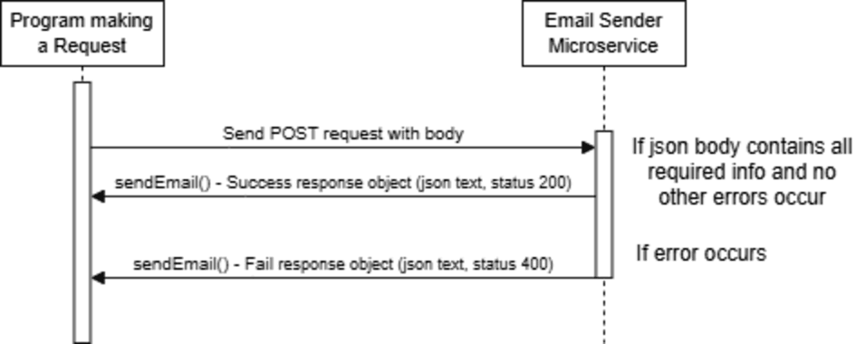

# 361-Email-Sender-Service

When ran locally, the service is accessible through the POST request route "http://127.0.0.1:8070/send_email". When sending a request to this endpoint to receive data, a request body with the following information is required: 

```json
{
    "subject": "(example subject)",
    "body": "(example body)",
    "receiver_email": "(example email)@gmail.com"
}
```
The endoint will return a string with a success message, along with the email's details if the email is successfully sent. If an error occurs, an error message string is sent.

Example call with Python:
```python
    url = "http://127.0.0.1:8070/send_email"
    data = {
        "subject": "Hello World",
        "body": "Hello How are you tonight",
        "receiver_email": "john@gmail.com"
    }
    message = requests.post(url, json=data)
    print(message.text)

```
UML Sequence Diagram:

